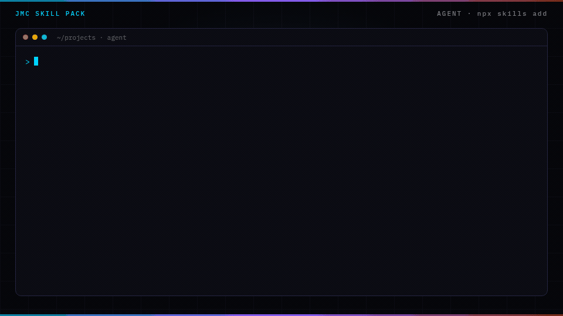

<p align="center">
  
</p>

<p align="center">
  
</p>

# GTM skills for Claude Code

Ten MIT skill packs for Claude Code: ideal customer profile, value proposition, cold email, LinkedIn posts, pricing strategy, landing page, generative engine optimization, sales offer, sales prospecting, and email sequence.

The build guide teaches the framework to a human. The pack teaches the same framework to an agent.

Give the instrument. Sell the compounding.

## Install the suite

One command per pack. Writes into Claude Code, Cursor, Codex, Grok, Copilot, Windsurf, Cline, OpenCode, and the rest of the [skills CLI](https://skills.sh) list.

```bash
npx skills add cmj-hub/claude-psp --all -g --full-depth
npx skills add cmj-hub/claude-evp --all -g --full-depth
npx skills add cmj-hub/claude-cold-email --all -g --full-depth
npx skills add cmj-hub/claude-founder-brand --all -g --full-depth
npx skills add cmj-hub/claude-pricing --all -g --full-depth
npx skills add cmj-hub/claude-landing-page --all -g --full-depth
npx skills add cmj-hub/claude-geo --all -g --full-depth
npx skills add cmj-hub/claude-sales-offer --all -g --full-depth
npx skills add cmj-hub/claude-prospect-list --all -g --full-depth
npx skills add cmj-hub/claude-email-sequence --all -g --full-depth
```

Claude Code, all ten as a plugin marketplace:

```text
/plugin marketplace add cmj-hub/gtm-operator-skills
/plugin install psp@gtm-operator-skills
/plugin install evp@gtm-operator-skills
/plugin install cold-email@gtm-operator-skills
/plugin install founder-brand@gtm-operator-skills
/plugin install pricing@gtm-operator-skills
/plugin install landing-page@gtm-operator-skills
/plugin install geo@gtm-operator-skills
/plugin install sales-offer@gtm-operator-skills
/plugin install prospect-list@gtm-operator-skills
/plugin install email-sequence@gtm-operator-skills
```

## The packs

| Pack | What it is | 15-minute artifact |
|---|---|---|
| [claude-psp](https://github.com/cmj-hub/claude-psp) | An ideal customer profile is who buys, drawn from a public signal and the words they use. | Score the sample 100 vs 37, then do yours |
| [claude-evp](https://github.com/cmj-hub/claude-evp) | A value proposition is one line that says why this buyer should care. | Three lines for three readers |
| [claude-cold-email](https://github.com/cmj-hub/claude-cold-email) | A cold email is a short note to someone who has not asked to hear from you, anchored to a public signal. | One T1, linted |
| [claude-founder-brand](https://github.com/cmj-hub/claude-founder-brand) | LinkedIn posts for founders are posts a buyer can tell came from the operator, written from a real receipt. | One Proof post from a real receipt |
| [claude-pricing](https://github.com/cmj-hub/claude-pricing) | A pricing strategy is how you choose what to charge, what the price is compared with, and where the discount leaks. | `decoy_validator` on the sample tiers |
| [claude-landing-page](https://github.com/cmj-hub/claude-landing-page) | A landing page is one page, one offer, and one action. | Score the sample page. A sitemap fails. |
| [claude-geo](https://github.com/cmj-hub/claude-geo) | Generative engine optimization is how a page gets quoted by an answer engine. | Score the sample page. A content calendar fails. |
| [claude-sales-offer](https://github.com/cmj-hub/claude-sales-offer) | A sales offer is what the buyer gets, what it costs, and why now. | Score the sample offer. A pitch of the paid product fails. |
| [claude-prospect-list](https://github.com/cmj-hub/claude-prospect-list) | Sales prospecting builds the B2B prospect list you are willing to write to. | Score the sample list. A title-only list fails. |
| [claude-email-sequence](https://github.com/cmj-hub/claude-email-sequence) | An email sequence is the series of emails after someone raises their hand. | Score the sample sequence. A generic drip fails. |

Each pack is MIT. No paid APIs inside. Scorers are Python you can run without an LLM.

## How the packs work together

Each pack does one job and hands off to the next. Install the ones you need; a pack that needs a missing companion names it and its install line instead of doing its job inline.

| Step | Pack | Call it | Reads | Hands off to |
|---|---|---|---|---|
| 1 | psp | `/psp:psp` | `operator`, `icp` | evp, prospect-list, pricing |
| 2 | evp | `/evp:evp` | `psp` | cold-email, landing-page, sales-offer |
| 3 | prospect-list | `/prospect-list:who-to-contact` | `psp.signal_anchors`, `icp` | cold-email, sales-offer |
| 4 | cold-email | `/cold-email:cold-email` | `psp`, `evp`, `tone`, `infrastructure` | email-sequence |
| 5 | sales-offer | `/sales-offer:cold-offer` | `psp`, `evp` | landing-page, pricing |
| 6 | pricing | `/pricing:pricing` | `psp`, `icp` | landing-page, sales-offer |
| 7 | landing-page | `/landing-page:page` | `evp`, `pricing` | email-sequence, geo |
| 8 | email-sequence | `/email-sequence:lifecycle-email` | `psp.vocabulary`, `evp` | — |
| 9 | geo | `/geo:geo` | `psp.vocabulary` | landing-page |
| 10 | founder-brand | `/founder-brand:founder-brand` | `operator`, `audience`, `pillars` | — |

Where two packs sound alike, they split the job:

- **cold-email** writes a signal-anchored first touch and its follow-ups. **sales-offer** writes a give-first first touch that hands over a finding and does not pitch.
- **prospect-list** picks who to contact this week. **cold-email** cleans a send list you already have.
- **email-sequence** writes to people who opted in. **cold-email** nurtures prospects who have not.

### Shared files

Every pack reads one `brand-config.json` and one `SOUL.md` at your project root.

- **Merge, never overwrite.** A pack reads the file, changes only the fields it owns, and leaves every other key alone. It asks before changing a field that already has a value.
- **`operator` and `icp` are shared.** Any pack fills a gap. None replaces a value.
- **Two published blocks carry the handoff.** psp writes `psp` when a primary profile is locked: `signal_anchors`, `primary_pain`, `timing_trigger`, `felt_pain_role`, `vocabulary`. evp writes `evp` when you pick the outreach line: `tier`, `primary`, `outcome`, `tradeoff`, `proof`. Downstream packs read these and do not invent them.
- **SOUL.md is voice, sectioned by pack.** Each pack edits its own `##` section. Voice can change word choice. It cannot lift a pack's limits.

## The gate

The gate for the next pack is [build/SKILL.md](build/SKILL.md). Run it from that directory, or install it with `/plugin install build-pack@gtm-operator-skills`. It is for pack authors, not a customer pack.

To check all ten packs together, clone them next to this repo and run:

```bash
python3 scripts/check_suite.py
```

It runs the gate, each pack's tests, `claude plugin validate --strict`, and a load check that every SKILL.md becomes a skill.

## The split

| Layer | What it is | Where it lives |
|---|---|---|
| Instrument | Framework, banned list, scorer, one worked example | These repos |
| Hosted | The same jobs, in a browser, no install | [Free tools](https://jaymountconsulting.com/prototypes) |
| Reference | Frameworks, playbooks, prompt library | [Frameworks](https://jaymountconsulting.com/frameworks) · [Prompt Library](https://jaymountconsulting.com/resources/prompt-library) |
| Growth Audit | Where your own book stands today | [Growth Audit](https://jaymountconsulting.com/growth-audit) |

This suite drafts and scores. It will not pick this quarter's PSP, ingest your CRM, or update when Gmail changes the spam window. Those are judgement calls and live data. This pack gives you the instrument and the rubric; you bring the account.


## Free, no signup

- **[All 30+ free tools](https://jaymountconsulting.com/prototypes)** — the same jobs these packs do, hosted. No account, no key.
- [Frameworks](https://jaymountconsulting.com/frameworks) — the written method behind each pack
- [Playbooks](https://jaymountconsulting.com/playbooks) · [Prompt Library](https://jaymountconsulting.com/resources/prompt-library) · [Calculator Pack](https://jaymountconsulting.com/resources/calculator-pack)

## Free, by email

[**Growth Audit**](https://jaymountconsulting.com/growth-audit) — where your go-to-market stack is leaking, sent to your inbox.

That one does ask for an email, and it enrols you in a short follow-up on the same topic. Unsubscribe whenever.

[**The Friday Signal**](https://jaymountconsulting.com/newsletter/signal) — one free edition a week on building GTM systems that compound. No pitch in it.

## Site

[jaymountconsulting.com/skills](https://jaymountconsulting.com/skills)

## License

MIT on every pack. Built by [Jay Mount Consulting](https://jaymountconsulting.com).

## Regenerating the artwork

`assets/social-preview.png` and `assets/header.png` are generated from `assets/spec.json` by a vendored renderer — no CI, no shared workflow, no network beyond the webfonts:

```bash
node assets/card.mjs assets/spec.json assets/
```

`assets/demo.gif` uses the same `spec.json` plus `assets/demo.mjs` (playwright-core + ffmpeg):

```bash
cd assets && npm install playwright-core
CHROME=/usr/bin/google-chrome node demo.mjs spec.json demo.gif
```
