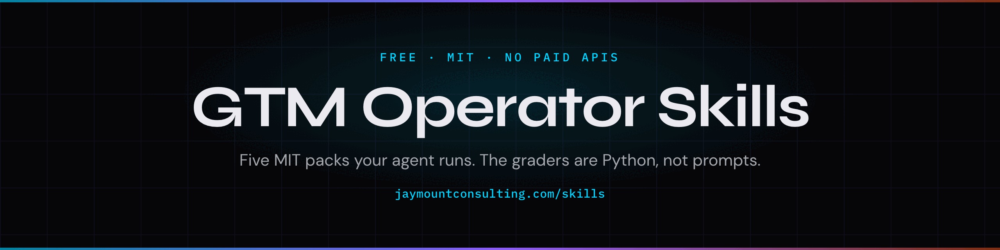

<p align="center">
  
</p>

# gtm-operator-skills

Five MIT skill packs for B2B operators.

The build guide teaches the framework to a human. The pack teaches the same framework to an agent.

Give the instrument. Sell the compounding.

## Install the suite

One command per pack. Writes into Claude Code, Cursor, Codex, Grok, Copilot, Windsurf, Cline, OpenCode, and the rest of the [skills CLI](https://skills.sh) list.

```bash
npx skills add cmj-hub/claude-psp --all -g --full-depth
npx skills add cmj-hub/claude-evp --all -g --full-depth
npx skills add cmj-hub/claude-cold-email --all -g --full-depth
npx skills add cmj-hub/claude-founder-brand --all -g --full-depth
npx skills add cmj-hub/claude-pricing --all -g --full-depth
npx skills add cmj-hub/claude-cold-offer --all -g --full-depth
npx skills add cmj-hub/claude-bridge --all -g --full-depth
npx skills add cmj-hub/claude-market --all -g --full-depth
npx skills add cmj-hub/claude-sending --all -g --full-depth
npx skills add cmj-hub/claude-list --all -g --full-depth
npx skills add cmj-hub/claude-waterfall --all -g --full-depth
npx skills add cmj-hub/claude-geo --all -g --full-depth
npx skills add cmj-hub/claude-page --all -g --full-depth
npx skills add cmj-hub/claude-cro --all -g --full-depth
npx skills add cmj-hub/claude-video --all -g --full-depth
npx skills add cmj-hub/claude-capture --all -g --full-depth
npx skills add cmj-hub/claude-lifecycle --all -g --full-depth
npx skills add cmj-hub/claude-issue --all -g --full-depth
npx skills add cmj-hub/claude-paid --all -g --full-depth
npx skills add cmj-hub/claude-analytics --all -g --full-depth
npx skills add cmj-hub/claude-motion --all -g --full-depth
npx skills add cmj-hub/claude-loop --all -g --full-depth
npx skills add cmj-hub/claude-sales --all -g --full-depth
npx skills add cmj-hub/claude-success --all -g --full-depth
npx skills add cmj-hub/claude-agent --all -g --full-depth
```

Claude Code, the five as a marketplace:

```text
/plugin marketplace add cmj-hub/gtm-operator-skills
/plugin install psp
/plugin install evp
/plugin install cold-email
/plugin install founder-brand
/plugin install pricing
```

## The packs

Foundation, offer, outbound, findability, pages, social, email, paid, measurement, and motion have a public pack.

| Group | Job | Pack | What it is | 15-minute artifact |
|---|---|---|---|---|
| Foundation | Pain | [claude-psp](https://github.com/cmj-hub/claude-psp) | A Pain Signal Profile is a five-part buying brief. It replaces a static ICP. | Score the sample 100 vs 37, then do yours |
| Foundation | Proposition | [claude-evp](https://github.com/cmj-hub/claude-evp) | An Early Value Proposition is a ≤22-word line matched to a Schwartz awareness tier. | Three tier lines from the sample PSP |
| Outbound | The letter | [claude-cold-email](https://github.com/cmj-hub/claude-cold-email) | Four jobs in under 90 words: signal, pain, EVP, binary ask. Demographics are not a signal. | One T1, linted |
| Social | Social post | [claude-founder-brand](https://github.com/cmj-hub/claude-founder-brand) | Pillar / Proof / Process / Person. Refuses thought-leader cadence. | One Proof post from a real receipt |
| Foundation | Price | [claude-pricing](https://github.com/cmj-hub/claude-pricing) | Pricing surgery: WTP, value metric, reference frame, three-tier contrast, pocket-price leaks. | `decoy_validator` on the sample tiers |
| Offer | Cold offer | [claude-cold-offer](https://github.com/cmj-hub/claude-cold-offer) | A leak, a prototype, and email one. The scorer refuses email one that sells the paid product. | `score.py` on the sample draft |
| Offer | Warm offer | [claude-bridge](https://github.com/cmj-hub/claude-bridge) | One bridge tier, the do-nothing price, and one guarantee. The scorer refuses a feature list. | `score.py` on the sample draft |
| Foundation | Market size | [claude-market](https://github.com/cmj-hub/claude-market) | Four pasted numbers and a reachability call. The scorer refuses a persona and a computed TAM. | `score.py` on the sample draft |
| Outbound | Sending setup | [claude-sending](https://github.com/cmj-hub/claude-sending) | A pasted SPF, DKIM, and DMARC result and a refuse-to-send. The scorer refuses a sequencer login as the product. | `score.py` on the sample draft |
| Outbound | Who to contact | [claude-list](https://github.com/cmj-hub/claude-list) | A list score from a signal. The scorer refuses a title-only list. | `score.py` on the sample draft |
| Outbound | Enrichment | [claude-waterfall](https://github.com/cmj-hub/claude-waterfall) | Keep-or-drop, confidence, a sunset date, and the cascade order. The scorer refuses a provider stack with no routing decision. | `score.py` on the sample draft |
| Findability | Findability | [claude-geo](https://github.com/cmj-hub/claude-geo) | A channel decision, a buyer question, a citation record, an indexability pass, one brief, and one kill date. | `score.py` on the sample draft |
| Pages | The page | [claude-page](https://github.com/cmj-hub/claude-page) | One URL, one offer, and one action. The scorer refuses a sitemap. There is no page course. | `score.py` on the sample draft |
| Pages | The test | [claude-cro](https://github.com/cmj-hub/claude-cro) | One test card, power computed, and a kill date. The scorer refuses a button-color test. | `score.py` on the sample draft |
| Social | Video | [claude-video](https://github.com/cmj-hub/claude-video) | One shot list and one script. The scorer refuses a channel calendar and a YouTube operating system. | `score.py` on the sample draft |
| Offer | Lead magnet | [claude-capture](https://github.com/cmj-hub/claude-capture) | One capture asset, one receipt, and value per lead. The scorer refuses a generic gated PDF with no bargain. | `score.py` on the sample draft |
| Email | Lifecycle email | [claude-lifecycle](https://github.com/cmj-hub/claude-lifecycle) | Welcome, delivery of the bargain, then nurture tied to the pain they showed. The scorer refuses a generic drip and a cold email. | `score.py` on the sample draft |
| Email | Newsletter | [claude-issue](https://github.com/cmj-hub/claude-issue) | One issue, or a refusal. The scorer refuses a dummy issue and a close sequence. | `score.py` on the sample draft |
| Paid | Paid ads | [claude-paid](https://github.com/cmj-hub/claude-paid) | A read of an export, one hypothesis, and a kill date. The scorer refuses a live write and a CPA-only plan. | `score.py` on the sample draft |
| Measurement | Analytics | [claude-analytics](https://github.com/cmj-hub/claude-analytics) | One chart and the decision it earns. The scorer refuses a chart with no decision. | `score.py` on the sample draft |
| Motion | The path | [claude-motion](https://github.com/cmj-hub/claude-motion) | Which doors exist, one channel, one owner, and one weekly number. The scorer refuses a plan that turns every channel on. | `score.py` on the sample draft |
| Motion | The loop | [claude-loop](https://github.com/cmj-hub/claude-loop) | The line that changed in the pain profile, the proposition, or the offer. The scorer refuses a dashboard with no write-back. | `score.py` on the sample draft |
| Motion | The call | [claude-sales](https://github.com/cmj-hub/claude-sales) | A call plan with the pain profile and a dated next step. | `score.py` on the sample draft |
| Motion | The customer | [claude-success](https://github.com/cmj-hub/claude-success) | One story, a named job, and a route. The scorer refuses a case study with no route. | `score.py` on the sample draft |
| Motion | One agent | [claude-agent](https://github.com/cmj-hub/claude-agent) | One agent card: job, cost, and a quality test. The scorer refuses an AI SDR with no single job. | `score.py` on the sample draft |

Each pack is MIT. No paid APIs inside. Scorers are Python you can run without an LLM.

The gate for the next pack is [build/SKILL.md](build/SKILL.md). Run it from that directory. It is not a sixth install.

## The split

| Layer | What it is | Where it lives |
|---|---|---|
| Instrument | Framework, banned list, scorer, one worked example | These repos |
| Hosted | The same jobs, in a browser, no install | [Free tools](https://jaymountconsulting.com/prototypes) |
| Reference | Frameworks, playbooks, prompt library | [Frameworks](https://jaymountconsulting.com/frameworks) · [Prompt Library](https://jaymountconsulting.com/resources/prompt-library) |
| Growth Audit | Where your own book stands today | [Growth Audit](https://jaymountconsulting.com/growth-audit) |

This suite drafts and scores. It will not pick this quarter's PSP, ingest your CRM, or update when Gmail changes the spam window. Those are judgement calls and live data. This pack gives you the instrument and the rubric; you bring the account.


## Free, no signup

- **[All 30+ free tools](https://jaymountconsulting.com/prototypes)** — the same jobs these packs do, hosted. No account, no key.
- [Frameworks](https://jaymountconsulting.com/frameworks) — the written method behind each pack
- [Playbooks](https://jaymountconsulting.com/playbooks) · [Prompt Library](https://jaymountconsulting.com/resources/prompt-library) · [Calculator Pack](https://jaymountconsulting.com/resources/calculator-pack)

## Free, by email

[**Growth Audit**](https://jaymountconsulting.com/growth-audit) — where your go-to-market stack is leaking, sent to your inbox.

That one does ask for an email, and it enrols you in a short follow-up on the same topic. Unsubscribe whenever.

[**The Friday Signal**](https://jaymountconsulting.com/newsletter/signal) — one free edition a week on building GTM systems that compound. No pitch in it.

## Site

[jaymountconsulting.com/skills](https://jaymountconsulting.com/skills)

## License

MIT on every pack. Built by [Jay Mount Consulting](https://jaymountconsulting.com).

## Regenerating the artwork

`assets/social-preview.png` and `assets/header.png` are generated from `assets/spec.json` by a vendored renderer — no CI, no shared workflow, no network beyond the webfonts:

```bash
node assets/card.mjs assets/spec.json assets/
```
